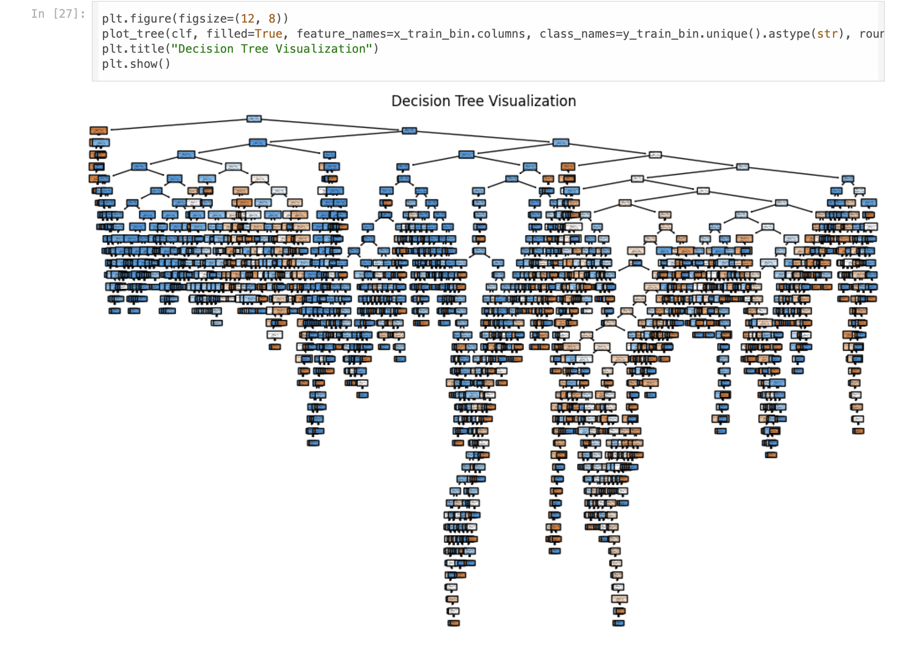
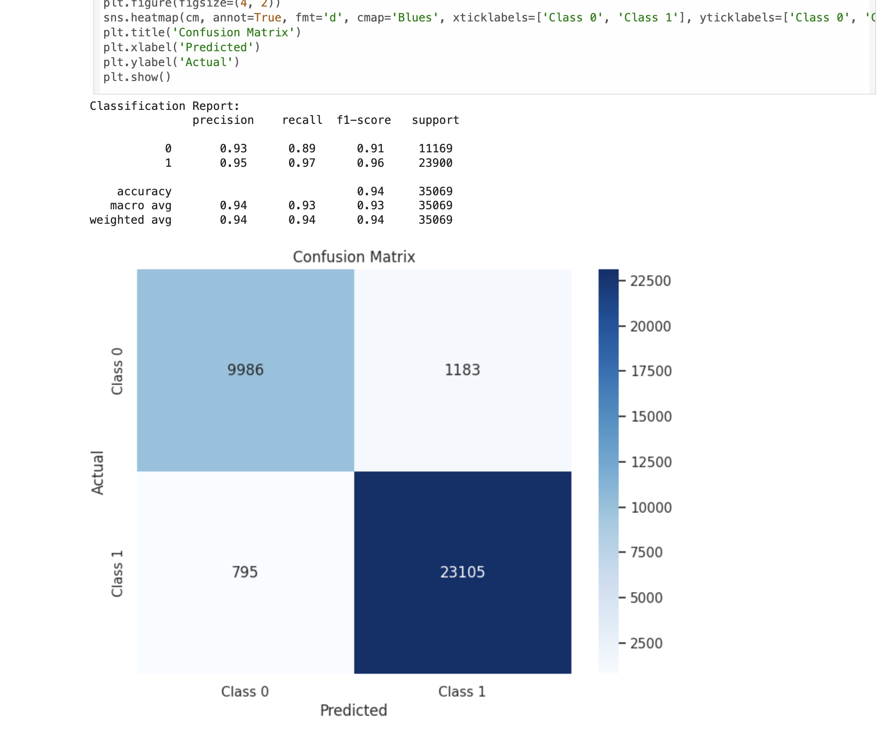

# Usage

This repository contains a sub-directory named Notebooks, which contains all the notebooks related to this project.

## Network Intrusion Detection System Using Machine Learning and Deep Learning

This repository contains the code and resources for building a **Network Intrusion Detection System (NIDS)** using various machine learning and deep learning algorithms. The project uses the **UNSW-NB15 dataset** to perform both binary and multi-class classification. Additionally, feature selection techniques are applied to improve model performance.

## Problem Statement

1. **Network Intrusion Detection** using machine learning and deep learning algorithms.
2. Utilizing the **UNSW-NB15 dataset**.
3. Implementing **feature selection techniques**.
4. Performing **binary and multi-class classification**.
5. Testing **scoring metrics** to evaluate model performance.
6. Apply some **hyperparameter tuning techniques**.

## Work Done

### 1. Preprocessing Techniques
- **NA & Duplicates Analysis**: Identifying and handling missing or duplicate data.
- **Encoding**: Transforming categorical data into a format suitable for machine learning algorithms.
- **Scaling**: Standardizing data for optimal model performance.
- **Train-Test Split**: Splitting the dataset for training and evaluation.

### 2. Exploratory Data Analysis (EDA)
- **Outlier Detection**: Identifying and addressing anomalies in the data.
- **Dataset Balancing**: Addressing class imbalance to improve model fairness.
- **Univariate & Multi-variate Analysis**: Examining relationships between features and the target variable.

### 3. Feature Selection
We applied several feature selection techniques to identify the most important features in the dataset:

- **Variance Threshold**: Removed features with low variance, which are unlikely to be useful in classification tasks.
- **Pearson Correlation**: Analyzed the correlation between features and removed highly correlated ones to prevent multicollinearity.
- **Exhaustive Feature Selection**: Iteratively evaluated all possible feature combinations to find the optimal subset.
- **Mutual Information**: Selected features based on mutual information with the target variable.
- **ROC AUC Curve**: Used the ROC AUC curve to rank features based on their contribution to model performance.

  
  

### 4. Classification Algorithms
We implemented several machine learning algorithms for both binary and multi-class classification tasks:

- **Decision Tree**
- **K-Nearest Neighbors (KNN)**
- **Support Vector Classifier (SVC)**
- **Multi-Layer Perceptron (MLP)**

Additionally, we used ensemble methods to improve model robustness and performance:

- **Random Forest**
- **AdaBoost**
- **Gradient Boosting**

  
  

These algorithms were carefully chosen to handle the complexities of the dataset and provide a comprehensive evaluation of model performance.

### 5. Hands-On Experience with Libraries
The project leverages various Python libraries such as:
- **Pandas** for data manipulation.
- **NumPy** for numerical operations.
- **Scikit-learn** for machine learning models.
- **Matplotlib/Seaborn** for data visualization.
- **TensorFlow/PyTorch** for deep learning models.

### 6. Hyperparameter Tuning
- **GridSearchCV** is used to find the optimal hyperparameters for the selected models, improving performance.

### 7. Metrics Used
- 4 Metrics were used namely - [Accuracy, Precision, Recall, F-score]

### 7. Ablation Study and Analysis
We perform an ablation study to understand the impact of various features and hyperparameters on model performance, offering insights into what contributes most to accuracy.

## Dataset

The dataset used in this project is the **UNSW-NB15 dataset**, which contains real-world network traffic data for intrusion detection.

- You can find the dataset [here](https://research.unsw.edu.au/projects/unsw-nb15-dataset).
